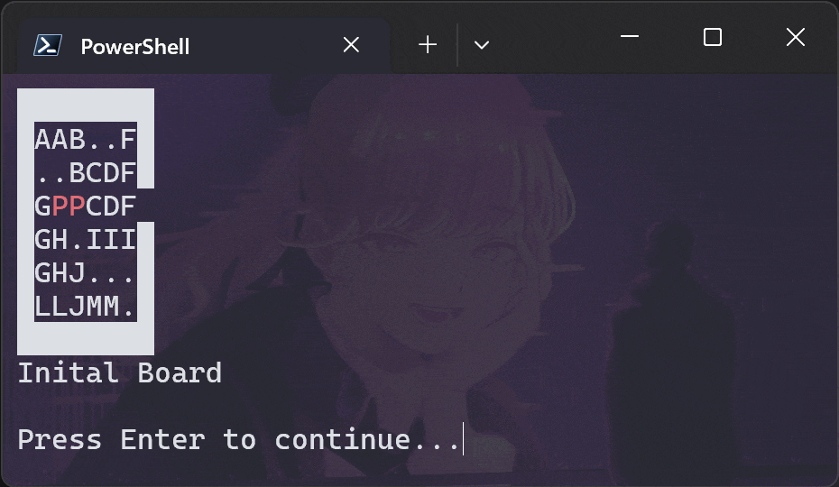

# Java Rush Hour Puzzle Solver


This project is a Java-based solver for Rush Hour.\
It supports multiple search algorithms and heuristics to find solutions efficiently.

## Features

- Supports GBFS, UCS, and A* search algorithms
- Multiple heuristics: BLOCKING_PIECES, EXIT_DISTANCE, BLOCKING_DISTANCE
- Board parsing from file
- Solution replay in the console

## Usage

Compile the project:

```
javac -d out src/**/*.java
```

Run the solver:

```
java -cp out Main <file> <algorithm> [heuristic]
```

- `<file>`: Path to the puzzle input file
- `<algorithm>`: GBFS, UCS, or A_STAR
- `[heuristic]`: (Optional) BLOCKING_PIECES, EXIT_DISTANCE, or BLOCKING_DISTANCE

Example:

```
java -cp out Main puzzles/level1.txt A_STAR BLOCKING_DISTANCE
```

## Input File Format

1. First line: `<rows> <cols>`
2. Second line: Number of pieces (excluding the primary piece)
3. Next lines: Board layout, using characters for pieces and `K` for the exit

Example:

```
6 6
12
AAB..F
..BCDF
GPPCDFK
GH.III
GHJ...
LLJMM.
```

## Project Structure

- `src/Main.java`: Entry point
- `src/Game/Parser.java`: Input file parser
- `src/Game/Board.java`: Board representation
- `src/Game/Pieces/`: Classes representing puzzle pieces
- `src/Algorithm/`: Search algorithms and heuristics